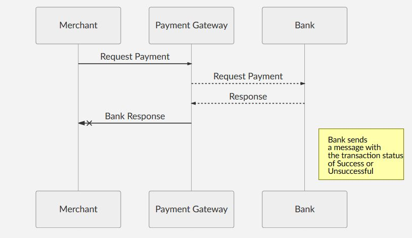
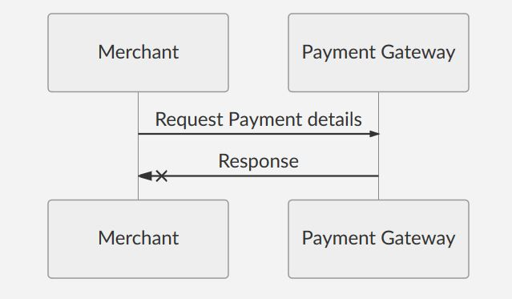
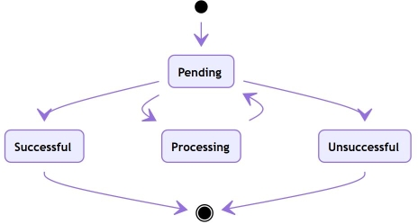
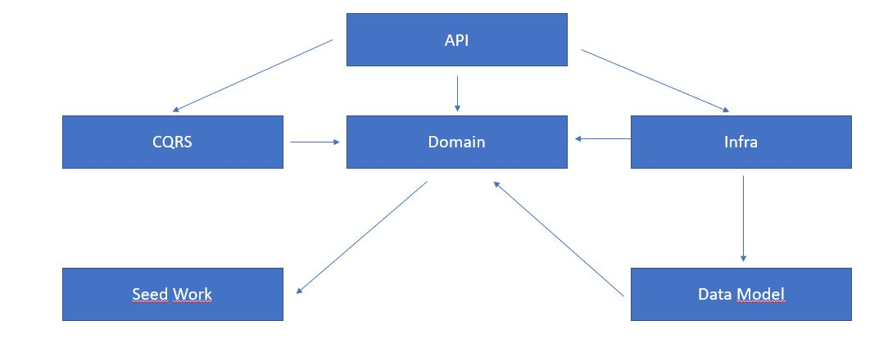

# Payment Gateway API 

This is an exercise for the code challenge from Checkout.com

# How to run

Go to the src folder

Run the command <blockquote>docker build -t payment-gateway-api .</blockquote> And then <blockquote>docker-compose up</blockquote>

This will build the docker container and run the application (api+grafana+prometheus) with docker-compose.

The following endpoints will be available:

<b>API:</b> http://localhost:5000 
<b>Grafana:</b> http://localhost:3000 
<b>Prometheus:</b> http://localhost:9090 

We can see some metrics here: http://localhost:9090/metrics

The Client for the API is in a separate solution, it will look for the API endpoint to run its tests.

# Business Discussion

We will be taking in account that the business needs 2 different flows, the first is requesting a payment from the merchant and the second one is retrieving a made transaction request. 

## Diagrams

<b>Merchant requests a payment</b>

 
<b>Merchant requests to see the details of a Payment</b>

<b>Overview of the big picture</b>

The actors of the whole system are:

A. Shopper: Individual who is buying the product online.

B. Merchant: The seller of the product.

C. Payment Gateway: Responsible for validating requests, storing card information and forwarding payment requests and accepting payment responses to and from the acquiring bank. 

D. Acquiring Bank: Allows us to do the actual retrieval of money from the shopper’s card and payout to the merchant. It also performs some validation of the card information and then sends the payment details to the appropriate 3rd party organization for processing.

# Technical Discussion

## Git branch strategy

Master branch rules:
 - It is protected against push
 - It doesn't allow a force push if the development branch is with build fail
 - Only accepts pull requests

# Technical Discussion

## Git branch strategy

Master branch rules:
 - It is protected against push
 - It doesn't allow a force push if the development branch is with build fail
 - Only accepts pull requests

## Techonologies, tools, methodologies and frameworks used

 - .NET Core 3.0 xUnit for unit testing Some concepts of DDD Serilog for
 - Application logging 
 - Grafana for showing a dashboard of metrics
 - Prometheus for the metrics server 
 - Docker to use containers (with docker-compose) 
 - Github Actions for the Build script (CI) 
 - Mrmaid-js for drawing the diagrams 
 - Git  
 - Visual Studio 2019 Enterprise
 - Swagger.io pkg to simplify the API development 
 - Mediatr pkg (implementation of the Mediator pattern) to handle the CQRS requests
 - Fluent Validator pkg to simplify the input validations with rules
 - CreditCardValidator nuget pkg to simplify the validation of a valid card
 - Microsoft.EntityFrameworkCore.InMemory nuget pkg to add the database in memory connection for testing
  
## System overview

<b>Request states lifecycle</b>

<b>Main domain classes relationship</b>

<b>Solution diagram and relationship between projects</b>

## Considerations and improvements

The best option was to have a DTO between the Data Model and the Domain projects and to expose the DTO to the external world, but to simplify this I choose to expose the Domain, no big deal for the solution porpose, if I had more time I would also add more unit tests and integration tests as well. I would also like to have the merchant info stored.

I didn't have time to prepare the solution to have a JWT token to handle authentication for example and 2 sides encryption, with a client secret and things like that, right now the solution is storing everything including the card number and CVV, it retrieves it masked to the client but it would be better to have encryption as well and to secure the database.

The solution uses Interface Segregation principle so that we can change the implementation easily like I did with the Bank Repository, we could add a client there to make the requests to the bank's API.

I also wanted to know how could I store a dashboard in Grafana without the JSON file generated.

The Client SDK can be accessed via the DI in .NET Core. It could be a nuget pkg maybe :)

## Lessons learned

I learned a few things I didn't know about Docker and specially the docker-compose.yml, it is a good way to build full applications and to pack and deliver, I also have never used Grafana nor Prometheus, so it was a good learning, I managed to develop a custom metric to expose in Grafana using the Prometheus library, it counts the requests made by the API, it is called <i>gatewayapi_path_counter</i> and it is available on Grafana.

## Achievements 

- [x] Application logging
- [x] Application metrics
- [ ] Authentication  
- [x] API client 
- [x] Build script / CI 
- [ ] Performance testing 
- [x] Data storage 
 
I haven't done the Authentication part and the performance testing (although there is a Mediator pipeline to measure the beginning and the end of each request).
